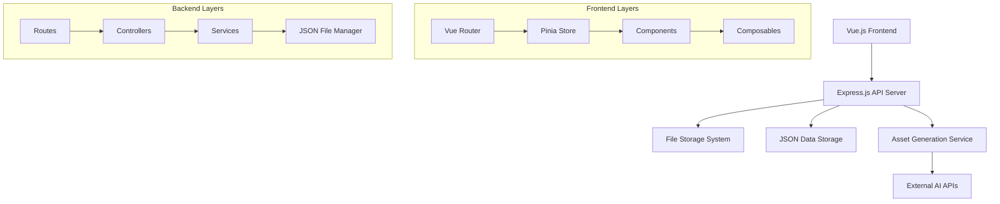

# Design Document

## Overview

The Asset Generation Tool is a full-stack web application built with Vue.js 3 (frontend) and Node.js with Express (backend). The system follows a RESTful API architecture with a clear separation between the client-side interface and server-side logic. The application uses a project-centric approach where users manage collections of assets with consistent styling through defined art style templates.

## Architecture

### High-Level Architecture



### Technology Stack

**Shared Types Package:**
- Zod for schema validation and type generation
- TypeScript for type definitions
- Private NPM package for distribution

**Frontend:**
- Vue.js 3 with Composition API
- Vue Router for navigation
- Pinia for state management
- Tailwind CSS for styling
- Vite for build tooling

**Backend:**
- Node.js with Express.js
- Multer for file uploads
- Sharp for image processing
- JSON file-based data storage
- File system operations for data persistence

## Components and Interfaces

### Frontend Components

#### Core Layout Components
- `AppLayout.vue` - Main application shell with navigation
- `ProjectSidebar.vue` - Project navigation and quick actions
- `AssetGallery.vue` - Grid display of project assets

#### Project Management Components
- `ProjectList.vue` - Dashboard showing all user projects
- `ProjectCard.vue` - Individual project preview card
- `ProjectForm.vue` - Create/edit project form with style settings
- `StyleDefinition.vue` - Art style configuration interface

#### Asset Creation Components
- `AssetCreator.vue` - Main asset creation interface
- `ImageGenerator.vue` - Image-specific generation form
- `VideoGenerator.vue` - Video-specific generation form
- `PromptGenerator.vue` - Text prompt creation tool
- `AssetPreview.vue` - Asset display with metadata

#### Utility Components
- `FileUpload.vue` - Drag-and-drop file upload component
- `LoadingSpinner.vue` - Loading state indicator
- `ConfirmDialog.vue` - Confirmation modal for destructive actions

### Backend API Endpoints

#### Project Management
```
GET    /api/projects           - List all projects
POST   /api/projects           - Create new project
GET    /api/projects/:id       - Get project details
PUT    /api/projects/:id       - Update project
DELETE /api/projects/:id       - Delete project
POST   /api/projects/:id/style - Upload style reference images
```

#### Asset Management
```
GET    /api/projects/:id/assets     - List project assets
POST   /api/projects/:id/assets     - Create new asset
GET    /api/assets/:id              - Get asset details
DELETE /api/assets/:id              - Delete asset
GET    /api/assets/:id/download     - Download asset file
```

#### Asset Generation
```
POST   /api/generate/image    - Generate image asset
POST   /api/generate/video    - Generate video asset
GET    /api/generate/status/:jobId - Check generation status
```

## Data Storage Architecture

### JSON File-Based Storage
The application uses a simple file-based storage system optimized for localhost development and small-scale usage. This approach eliminates database dependencies while maintaining data integrity and performance for typical use cases.

#### Storage Structure
```
data/
├── projects/
│   ├── projects.json          # Project index and metadata
│   └── {projectId}/
│       ├── project.json       # Individual project data
│       ├── assets.json        # Project assets index
│       └── assets/            # Asset files and metadata
│           ├── {assetId}.json # Asset metadata
│           └── files/         # Generated asset files
└── jobs/
    └── generation-jobs.json   # Active generation jobs
```

#### Data Access Layer
- **FileManager Service**: Handles all JSON file read/write operations
- **Atomic Operations**: Ensures data consistency during concurrent access
- **Backup Strategy**: Automatic backup creation before data modifications
- **Index Management**: Maintains efficient lookup indexes for projects and assets

#### Performance Considerations
- In-memory caching for frequently accessed data
- Lazy loading for large asset collections
- File watching for real-time updates
- Optimized JSON serialization/deserialization

## Data Models

### Shared Types Package Structure
The shared types package (`@asset-tool/types`) will contain Zod schemas that generate both TypeScript types and runtime validation:

```typescript
// Project Schema (Zod)
export const ProjectSchema = z.object({
  id: z.string(), // UUID instead of MongoDB ObjectId
  name: z.string().min(1).max(100),
  description: z.string().max(500),
  context: z.string().max(1000),
  artStyle: z.object({
    description: z.string().max(2000),
    referenceImages: z.array(z.string()),
    styleKeywords: z.array(z.string())
  }),
  createdAt: z.string().datetime(), // ISO string for JSON compatibility
  updatedAt: z.string().datetime()
})

export type Project = z.infer<typeof ProjectSchema>
```

```typescript
// Asset Schema (Zod)
export const AssetSchema = z.object({
  id: z.string(), // UUID instead of MongoDB ObjectId
  projectId: z.string(),
  type: z.enum(['image', 'video', 'prompt']),
  name: z.string().min(1).max(100),
  description: z.string().max(500).optional(),
  filePath: z.string().optional(),
  generationPrompt: z.string(),
  generationParameters: z.record(z.any()),
  status: z.enum(['pending', 'generating', 'completed', 'failed']),
  createdAt: z.string().datetime(), // ISO string for JSON compatibility
  metadata: z.object({
    dimensions: z.object({
      width: z.number(),
      height: z.number()
    }).optional(),
    duration: z.number().optional(),
    fileSize: z.number().optional(),
    format: z.string().optional()
  })
})

export type Asset = z.infer<typeof AssetSchema>
```

```typescript
// Generation Job Schema (Zod)
export const GenerationJobSchema = z.object({
  id: z.string(), // UUID instead of MongoDB ObjectId
  assetId: z.string(),
  status: z.enum(['queued', 'processing', 'completed', 'failed']),
  progress: z.number().min(0).max(100),
  errorMessage: z.string().optional(),
  createdAt: z.string().datetime(), // ISO string for JSON compatibility
  completedAt: z.string().datetime().optional()
})

export type GenerationJob = z.infer<typeof GenerationJobSchema>
```

### API Request/Response Schemas
```typescript
// API validation schemas
export const CreateProjectRequestSchema = ProjectSchema.omit({ 
  id: true, 
  createdAt: true, 
  updatedAt: true 
})

export const UpdateProjectRequestSchema = CreateProjectRequestSchema.partial()

export const CreateAssetRequestSchema = AssetSchema.omit({ 
  id: true, 
  createdAt: true, 
  status: true 
})
```

## Error Handling

### Frontend Error Handling
- Global error boundary component to catch and display errors
- Toast notifications for user-facing error messages
- Retry mechanisms for failed API calls
- Offline state detection and user feedback

### Backend Error Handling
- Centralized error middleware for consistent error responses
- Validation errors with detailed field-level feedback
- Rate limiting for API endpoints
- File upload size and type validation
- Database connection error recovery

### Error Response Format
```typescript
interface ErrorResponse {
  error: {
    code: string
    message: string
    details?: Record<string, any>
    timestamp: string
  }
}
```

## Testing Strategy

### Frontend Testing
- **Unit Tests**: Vue Test Utils for component testing
- **Integration Tests**: Testing component interactions and API calls
- **E2E Tests**: Playwright for full user workflow testing
- **Visual Regression**: Screenshot comparison for UI consistency

### Backend Testing
- **Unit Tests**: Jest for service and utility function testing
- **Integration Tests**: API endpoint testing with temporary JSON test data
- **File System Tests**: JSON file operations and data integrity testing
- **Load Tests**: Performance testing for asset generation endpoints
- **Security Tests**: Input validation and file system security testing

### Test Coverage Goals
- Minimum 80% code coverage for critical paths
- 100% coverage for data validation and security functions
- Automated testing in CI/CD pipeline
- Manual testing checklist for new features

### Testing Scenarios
1. **Project Lifecycle**: Create, update, delete projects with style settings
2. **Asset Generation**: Generate different asset types with style consistency
3. **File Management**: Upload, download, and delete asset files
4. **Error Scenarios**: Network failures, invalid inputs, generation failures
5. **Performance**: Large project handling, concurrent generation requests
6. **Mobile Responsiveness**: Touch interactions and responsive layouts