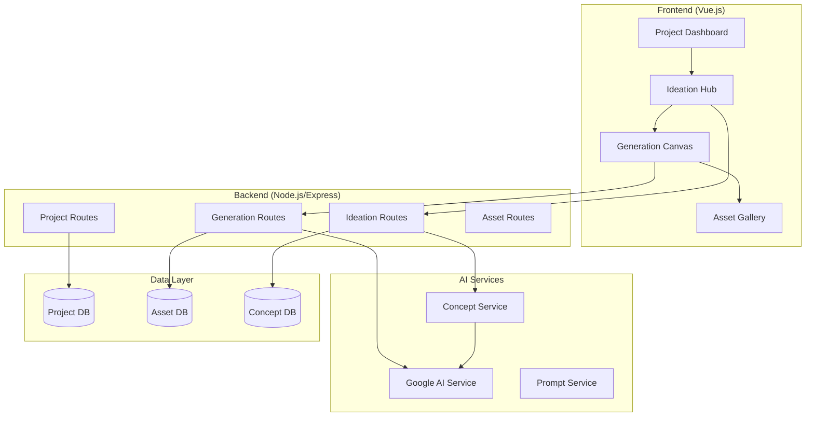
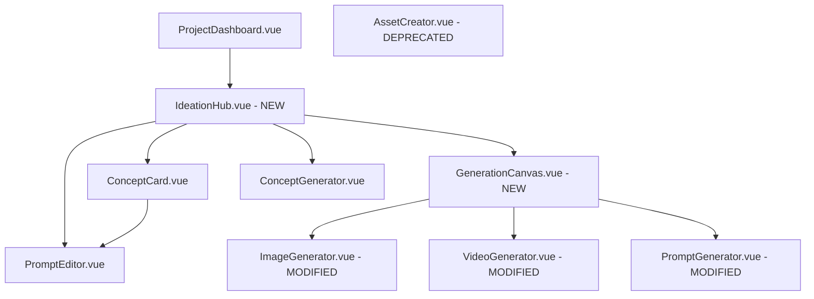

# Design Document

## Overview

The Two-Step Creative Workflow redesigns the asset creation process by separating creative ideation from technical execution. This approach transforms the current single-modal workflow into a guided, two-stage process that enhances user creativity while reducing wasted generations.

The workflow consists of:
1. **Ideation Hub** - A creative brainstorming interface where users define intent and refine AI-generated concepts
2. **Generation Canvas** - A technical execution interface focused on asset parameters and production

This design leverages the existing Vue.js frontend architecture, Node.js backend with Express, and Google AI integration while introducing new components and API endpoints to support the enhanced workflow.

## Architecture

### High-Level Architecture



### Component Hierarchy



## Components and Interfaces

### New Frontend Components

#### 1. IdeationHub.vue
**Purpose**: Main interface for Step 1 - creative ideation and concept development

**Props**:
```typescript
interface Props {
  project: Project
  initialIntent?: string
}
```

**Key Features**:
- Intent input field with natural language processing
- AI-powered concept generation using project Style Core
- Concept card display with editing capabilities
- "Suggest More" functionality for additional concepts
- Navigation to Generation Canvas

**State Management**:
```typescript
interface IdeationState {
  userIntent: string
  concepts: ConceptCard[]
  selectedConcept: ConceptCard | null
  isGeneratingConcepts: boolean
  conceptBatches: ConceptCard[][]
  currentBatchIndex: number
}
```

#### 2. ConceptCard.vue
**Purpose**: Individual concept display and editing component

**Props**:
```typescript
interface Props {
  concept: ConceptCard
  isSelected: boolean
  isEditable: boolean
}
```

**Features**:
- Concept preview with title and description
- Inline prompt editing with syntax highlighting
- Selection state management
- Edit/save/cancel functionality

#### 3. PromptEditor.vue
**Purpose**: Rich text editor for prompt refinement

**Props**:
```typescript
interface Props {
  initialPrompt: string
  projectStyle: ArtStyle
  readOnly?: boolean
}
```

**Features**:
- Syntax highlighting for prompt keywords
- Real-time character count
- Style keyword suggestions
- Undo/redo functionality

#### 4. GenerationCanvas.vue
**Purpose**: Main interface for Step 2 - technical asset generation

**Props**:
```typescript
interface Props {
  project: Project
  selectedConcept: ConceptCard
  initialAssetType?: 'image' | 'video' | 'prompt'
}
```

**Features**:
- Locked prompt display with "Back to Ideation" option
- Asset type selection (Image/Video only)
- Technical parameter configuration
- Advanced settings accordion
- Generation execution

### Modified Existing Components

#### AssetCreator.vue - DEPRECATED
This component will be replaced by the two-step workflow. Existing functionality will be migrated to GenerationCanvas.vue.

#### ImageGenerator.vue, VideoGenerator.vue, PromptGenerator.vue - MODIFIED
These components will be simplified to focus only on technical parameters, removing creative ideation elements:

**Removed Elements**:
- Prompt input fields (moved to Ideation Hub)
- Creative brainstorming features
- Style override sections (simplified)

**Enhanced Elements**:
- Technical parameter focus
- Pre-filled asset names based on intent
- Streamlined UI for faster execution

### Backend API Extensions

#### New Routes: `/api/ideation`

```typescript
// POST /api/ideation/concepts - Generate concept ideas
interface GenerateConceptsRequest {
  projectId: string
  userIntent: string
  styleCore: ArtStyle
  excludeConceptIds?: string[]
  batchSize?: number
}

interface GenerateConceptsResponse {
  concepts: ConceptCard[]
  batchId: string
}

// PUT /api/ideation/concepts/:id - Update concept
interface UpdateConceptRequest {
  prompt: string
  title?: string
  description?: string
}

// POST /api/ideation/validate - Validate concept before generation
interface ValidateConceptRequest {
  concept: ConceptCard
  assetType: 'image' | 'video' | 'prompt'
}
```

#### Enhanced Routes: `/api/generation`

```typescript
// Modified generation endpoints to accept concept-based requests
interface GenerateAssetRequest {
  projectId: string
  conceptId: string
  assetType: 'image' | 'video' | 'prompt'
  assetName: string
  technicalParameters: TechnicalParameters
  styleOverrides?: StyleOverride
}
```

### New Backend Services

#### ConceptService
**Purpose**: Handle concept generation and management

```typescript
class ConceptService {
  async generateConcepts(request: GenerateConceptsRequest): Promise<ConceptCard[]>
  async updateConcept(conceptId: string, updates: Partial<ConceptCard>): Promise<ConceptCard>
  async validateConcept(concept: ConceptCard, assetType: string): Promise<ValidationResult>
  async saveConcept(concept: ConceptCard): Promise<void>
}
```

**Key Methods**:
- `generateConcepts()`: Uses Google AI to create multiple concept variations
- `updateConcept()`: Handles user edits to generated concepts
- `validateConcept()`: Ensures concept is suitable for asset generation

#### IdeationService
**Purpose**: Orchestrate the ideation workflow

```typescript
class IdeationService {
  async processUserIntent(intent: string, project: Project): Promise<ConceptCard[]>
  async generateMoreConcepts(existingConcepts: ConceptCard[], project: Project): Promise<ConceptCard[]>
  async refinePrompt(prompt: string, refinements: string[]): Promise<string>
}
```

## Data Models

### New Data Models

#### ConceptCard
```typescript
interface ConceptCard {
  id: string
  projectId: string
  userIntent: string
  title: string
  description: string
  prompt: string
  conceptType: 'ai-generated' | 'user-created' | 'template-based'
  styleInfluences: string[]
  createdAt: string
  updatedAt: string
  metadata: {
    aiModel?: string
    generationParameters?: any
    editHistory?: PromptEdit[]
  }
}
```

#### PromptEdit
```typescript
interface PromptEdit {
  id: string
  timestamp: string
  originalPrompt: string
  editedPrompt: string
  editType: 'user-manual' | 'ai-suggestion' | 'template-applied'
  reasoning?: string
}
```

#### IdeationSession
```typescript
interface IdeationSession {
  id: string
  projectId: string
  userIntent: string
  conceptBatches: ConceptCard[][]
  selectedConceptId?: string
  sessionState: 'ideation' | 'generation' | 'completed'
  createdAt: string
  updatedAt: string
}
```

### Enhanced Existing Models

#### Asset - Enhanced
```typescript
interface Asset {
  // ... existing fields
  conceptId?: string // Link to originating concept
  originalIntent?: string // User's original intent
  conceptHistory?: {
    originalConcept: ConceptCard
    finalConcept: ConceptCard
    editCount: number
  }
}
```

#### GenerationJob - Enhanced
```typescript
interface GenerationJob {
  // ... existing fields
  conceptId?: string
  workflowStep: 'ideation' | 'generation'
  ideationMetadata?: {
    conceptsGenerated: number
    userEdits: number
    timeInIdeation: number
  }
}
```

## Error Handling

### Ideation Hub Error Scenarios

1. **Concept Generation Failure**
   - Fallback to template-based concepts
   - Allow manual concept creation
   - Graceful degradation to single-step workflow

2. **AI Service Unavailable**
   - Cache previous concepts for reuse
   - Provide manual prompt creation tools
   - Clear error messaging with alternatives

3. **Invalid User Intent**
   - Guided prompts to help clarify intent
   - Example intents for inspiration
   - Progressive disclosure of requirements

### Generation Canvas Error Scenarios

1. **Missing Concept Data**
   - Redirect back to Ideation Hub
   - Preserve user progress
   - Clear navigation guidance

2. **Technical Parameter Validation**
   - Real-time validation feedback
   - Smart defaults based on concept
   - Clear error messaging

## Testing Strategy

### Unit Testing

#### Frontend Components
- **IdeationHub.vue**: Intent processing, concept display, navigation
- **ConceptCard.vue**: Editing functionality, selection states
- **GenerationCanvas.vue**: Parameter validation, prompt display

#### Backend Services
- **ConceptService**: Concept generation, validation, updates
- **IdeationService**: Intent processing, workflow orchestration

### Integration Testing

#### Workflow Testing
- Complete two-step workflow from intent to asset
- Cross-component state management
- API integration between steps

#### AI Integration Testing
- Google AI service concept generation
- Prompt enhancement and validation
- Error handling for AI service failures

### End-to-End Testing

#### User Journey Testing
- New user onboarding through two-step workflow
- Experienced user efficiency improvements
- Error recovery and fallback scenarios

#### Performance Testing
- Concept generation response times
- Large project handling
- Concurrent user sessions

### Testing Data

#### Mock Concepts
```typescript
const mockConcepts: ConceptCard[] = [
  {
    id: 'concept-1',
    title: 'Professional Team Collaboration',
    description: 'A diverse team working together in a modern office setting',
    prompt: 'A diverse group of professionals collaborating around a modern desk, natural lighting, contemporary office space, focused expressions, laptops and documents visible',
    conceptType: 'ai-generated'
  },
  {
    id: 'concept-2', 
    title: 'Abstract Teamwork Visualization',
    description: 'Abstract representation of collaboration and synergy',
    prompt: 'Abstract geometric shapes connecting and flowing together, representing teamwork and collaboration, modern color palette, clean minimalist design',
    conceptType: 'ai-generated'
  }
]
```

## Implementation Phases

### Phase 1: Core Infrastructure
- Create new component structure
- Implement basic ConceptService
- Set up new API routes
- Basic concept generation

### Phase 2: Ideation Hub
- Complete IdeationHub.vue implementation
- ConceptCard editing functionality
- Integration with existing project system
- User intent processing

### Phase 3: Generation Canvas
- Modify existing generator components
- Implement concept-to-generation flow
- Technical parameter focus
- Asset-concept linking

### Phase 4: Polish & Integration
- Error handling and edge cases
- Performance optimization
- User experience refinements
- Migration from old workflow

This design maintains backward compatibility while introducing the new two-step workflow as the primary user experience. The existing single-step components remain available as fallbacks, ensuring system reliability during the transition.